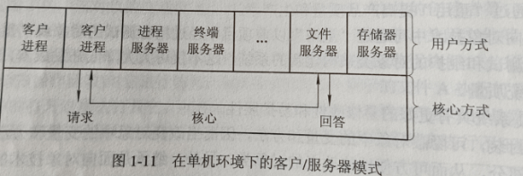

# 第一章 操作系统引论

## 1.设计现代 OS 的主要目标是什么?
方便性，有效性，可扩充性，开放性

## 2.OS的作用可表现在哪几个方面?
操作员系统在计算机系统中所起的作用，可以从用户、资源管理及资源抽象等多个方面来看：

1. **OS作为用户与计算机硬件系统之间的接口**。
2. **OS作为计算机系统资源的管理者**。
3. **OS实现了对计算机系统的抽象**。 

## 3.为什么说操作系统实现了对计算机资源的抽象?
OS是铺设在计算机硬件之上的多层软件的集合，他们不仅隐藏了对硬件系统的具体细节，还增强了系统的功能.实现了对计算机硬件操作的多个层次的抽象模型。值得说明的是，不仅可在底层对一个硬件资源加以抽象，还可以在高层对该资源底层已抽象的模型再次进行抽象，成为更高的抽象模型。随着抽象层次的提高，抽象接口所提供的功能就越强，用户使用起来也越方便。

## 4.试说明推动多道批处理系统形成和发展的主要动力是什么，
为了解决单道批处理系统硬件资源浪费严重的问题，进一步提高资源的利用率和系统吞吐量，20世纪60年代中期IBM引入了多到程序设计技术，由此形成了多道批处理系统。

## 5.何谓脱机 I/O 和联机 I/O?
为了解决<u>人机矛盾</u>及CPU和I/O设备之间速度不匹配的矛盾，20世纪50年代末出现了脱机I/O技术，该技术是事先将装有用户程序和数据的纸带装入纸带输入机，在一台外围机的控制下，把纸带（卡片）上的数据输入到磁带上，当CPU需要这些程序和数据时，再从磁带上高速调入内存。

类似地，当CPU需要输出时，可先由CPU把数据直接从内存高速地输送到磁带上，然后在**另一台**外围机的控制下，再将磁带上的结果通过相应的输出设备输出。

由于程序和数据的输入和输出都是在外围机的控制下完成的，或者说，它们是在脱离主机的情况下进行的，故称为脱机输入/输出方式。
反之，把在主机的直接控制下进行输入/输出的方式称为联机输入/输出方式。

## 6.试说明推动分时系统形成和发展的主要动力是什么
如果说推动多道批处理系统形成和发展的主要动力是提高资源利用率和系统吞吐量，那么，推动分时系统形成和发展的主要动力，则是为了满足用户对人一机交互的需求，由此形成了一种新型 OS。

由上所述不难得知，分时系统是指，在一台主机上连接了多个配有显示器和键盘的丝端并由此所组成的系统，该系统允许多个用户同时通过自己的终端，以交互方式使用计务机，共享主机中的资源，

## 7.实现分时系统的关键问题是什么?应如何解决?
关键问题是，如何使用户能与自己的作业进行交互。为此，系统首先必须能提供多个终端，同时给多个用户使用；其次，当用户在自己的终端上键入命令时，系统应能及时接收，并及时处理该命令，再将结果返回给用户。此后，用户可根据系统返回的响应情况，再继续键入下一条命令，此即人-机交互。

## 8.为什么要引入实时操作系统?
实时系统能及时响应外部事件的请求，在规定的时间内完成对该事件的处理，并控制所有实时任务协调一致地运行。

## 9.什么是硬实时任务和软实时任务?试举例说明。
硬实时任务(Hard Real-time Task，HRT)：是指系统必须满足任务对截止时间的要求，否则可能出现难以预测的后果。用于工业和武器控制的实时系统，通常它所执行的是硬实时任务。

软实时任务(SoftReal-time Task，SRT)：也联系着一个截止时间，但并不严格，若偶尔错过了任务的截止时间，对系统产生的影响也不会太大。诸如用于信息查询系统和多媒体系统中的实时系统，通常是软实时任务。

## 10.试从交互性、及时性以及可靠性方面将分时系统与实时系统进行比较。
及时性：信息查询系统对实时性的要求是依据人所能接受的等待时间确定的，而多媒体系统实时性的要求是，播放出来的音乐和电视能令人满意。实时控制系统的实时性则是以控制对象所要求的截止时间来确定的，一般为秒级到毫秒级。

交互性：在信息查询系统中，人与系统的交互性仅限于访问系统中某些特定的专用服务程序。它并不像分时系统那样，能向终端用户提供数据处理、资源共享等服务。而多媒体系统的交互性也仅限于用户发送某些特定的命令，如开始、停止、快进等，由系统立即响应。

可靠性：分时系统要求系统可靠，实时系统要求系统高度可靠，因为任何差错都可能带来无法预料的灾难性后果。因此，在实时系统中，往往都采取了多级容错措施来保障系统的安全性及数据的安全性。

## 11.OS有哪几大特征?其最基本的特征是什么?
有三大特征：1.高资源利用率和系统吞吐量 2.及时响应 3.实时特征
基本特征：并发，共享，虚拟，异步
> 并行性：两个或多个事件在同一时刻发生
> 
> 并发性：两个或多个事件在同一时间间隔内发生

## 12.在多道程序技术的 OS 环境下的资源共享与一般情况下的资源共享有何不同?独占资源应采取何种共享方式?

一般情况下的资源共享，只是说明某种资源能被大家使用，但并没有限定各方用户必须在同一时间和同一地点使用，因此只要通过适当的安排，用户之间并不会产生对资源的竞争，因此资源管理是比较简单的。

OS环境下的资源共享或称为资源复用，是指系统中的资源可供内存中多个并发的进程共同使用。

独占资源可以采取互斥共享方式。

## 13.什么是时分复用技术?举例说明它能提高资源利用率的根本原因是什么。
时分复用技术：利用某设备为一用户服务的空闲时间，又转去为其他用户服务，使设备得到最充分的利用。

举例来看，利用时分复用技术当中的虚拟设备技术，原来属于临界资源的打印机现在可以将它变为多台逻辑上的打印机，以供多个用户“同时”打印。

## 14.是什么原因使操作系统具有异步性特征?

对于内存中的每个进程，在何时能获得处理机运行，何时又因提出某种资源请求而暂停，以及进程以怎样的速度向前推进，每道程序总共需要多少时间才能完成等等，都是不可预知的。由于各用户程序性能的不同，比如，有的侧重于计算而较少需要O;而有的程序其计算少而IO 多，这样，很可能是先进入内存的作业后完成，而后进入内存的作业先完成。或者说，**进程是以人们不可预知的速度向前推进的，此即进程的异步性**。

## 15.处理机管理有哪些主要功能?其主要任务是什么?
1. 进程控制：在多道程序环境下为使作业能并发执行，必须为每道作业创建一个或多个进程，并为之分配必要的资源。
2. 进程同步：为多个进程（含线程）的运行进行协调，保证多个进程可以有条不紊地运行。
3. 进程通信：获得当有一组相互合作的进程去完成一个共同的任务时，在它们之间往往需要交换信息。
4. 调度：在传统OS中，调度包括作业调度和进程调度两步。
    - 作业调度。作业调度的基本任务是从后备队列中按照一定的算法选择出若干个作业，为它们分配运行所需的资源，在将这些作业调入内存后，分别为它们建立进程，使它们都成为可能获得处理机的就绪进程，并将它们插入就绪队列中。

    - 进程调度。进程调度的任务是从进程的就绪队列中按照一定的算法选出一个进程，将处理机分配给它，并为它设置运行现场，使其投入执行。

## 16.内存管理有哪些主要功能?其主要任务是什么?

（内存）存储器管理的主要任务，是为多道程序的运行**提供良好的环境**、**方便用户使用**，并能从**逻辑上扩充内存**。为此，存储器管理应具有内存分配和回收、内存保护、地址映射和内存扩充等功能。

## 17.设备管理有哪些主要功能?其主要任务是什么?
设备管理的主要任务如下:

(1)完成用户进程提出的IO请求,为用户进程分配所需的I/O设备,并完成指定的I/O操作。

(2)提高CPU和I/O设备的利用率，提高I/O速度，方便用启使用I/O设备。
为实现上述任务,设备管理应具有**缓冲管理**、**设备分配**和**设备处理**以及**虚拟设备**等功能

## 18.文件管理有哪些主要功能?其主要任务是什么?

文件管理的主要任务是对用户文件和系统文件进行管理以方便用户使用，并保证文件的安全性。为此，文件管理应具有对**文件存储空间的管理**、**目录管理**、**文件的读/写管理**以及**文件的共享与保护**等功能。

## 19.试说明推动传统OS演变为现代OS的主要因素是什么?

现代用户对**系统安全**、**网络功能和服务**以及**支持多媒体**的越来越强烈的需求。

## 20.什么是微内核 OS?

微内核OS是一种，为了提高操作系统的“正确性”、“灵活性”、“易维护性”和“可扩充性”，而拥有足够小的内核，基于客户/服务器服务器模式，应用了“机制与策略分离”原理与向对象技术的一类现代OS。

## 21.微内核操作系统具有哪些优点?它为何能有这些优点?

由于微内核 OS 结构是建立在模块化、层次化结构的基础上的，并采用了客户/服务器模式和面向对象的程序设计技术，因此，微内核结构的操作系统是集各种技术优点之大成因而使之具有如下优点:

(1)提高了系统的可扩展性。
> 由于微内核OS的许多功能是由相对独立的服务器软件来实现的，当开发了新的硬件和软件时，微内核OS只需在相应的服务器中增加新的功能，或再增加一个专门的服务器。与此同时，也必然改善系统的灵活性，不仅可在操作系统中增加新的功能，还可修改原有的功能，以及删除已过时的老功能，以形成一个更为精干的有效的操作系统。

(2)增强了系统的可靠性。
> 这一方面是由于微内核是通过精心设计和严格测试的，容易保证其正确性，另一方面，它提供了**规范而精简的应用程序接口(API)**，为微内核外部的程序编制高质量的代码创造了条件。此外，由于所有服务器都是**运行在用户态服务器与服务器之间采用的是消息传递通信机制**，<U>因此，当某个服务器出现错误时，不会影响内核，也不会影响其它服务器。</U>

(3)可移植性强。
> 随着硬件的快速发展，出现了各种各样的硬件平台，作为一个好的操作系统，必须具备可移植性，使其能较容易地运行在不同的计算机硬件平台上。在微内核结构的操作系统中，所有与特定CPU和I/O设备便件有关的代码，均放在内核和内核面的硬件隐藏层中，而操作系统其它绝大部分--各种服务器，均与硬件平台无关，因而把操作系统移植到另一个计算机硬件平台上所需作的修改是比较小的。

(4)提供了对分布式系统的支持。
> 由于在微内核OS中，客户和服务器之间、服务器和服务器之间的通信采用消息传递通信机制，致使微内核OS能很好地支持分布式系统和网络系统。事实上，只要在分布式系统中赋予所有进程和服务器唯一的标识符，在微内核中再配置一张系统映射表(即进程和服务器的标识符与它们所驻留的机器之间的对应表)，在进行客户与服务器通信时，只需在所发送的消息中标上发送进程和接收进程的标识符，内核便可利用系统映射表将消息发往目标，而无论目标是驻留在哪台机器上。

(5)融入了面向对象技术。
> 在设计微内核 OS 时采用了面向对象的技术，其中的“封装”“继承”,“对象类”和“多态性”，以及在对象之间采用消息传递机制等，都十分有利于提高系统的正确性、可靠性、易修改性、易扩展性等,而且还能显著地减少开发系统所付出的开销

## 22.现代操作系统较之传统操作系统又增加了哪些功能和特征?

现代操作系统相比传统操作系统增加了以下功能和特征：

1. 并发和多任务处理
现代操作系统支持并发和多任务处理，这意味着它们能够同时管理多个进程或线程，提高了资源利用率和系统吞吐量。

2. 抢占式多任务调度
与早期的合作式多任务处理不同，现代操作系统采用抢占式多任务调度，确保高优先级的任务能够获得必要的处理时间，从而提高了系统的响应能力和效率。

3. 分布式系统支持
现代操作系统能够在分布式系统中运行，这些系统由多个独立的计算机组成，共同协作完成任务，提供了更高的可靠性、可扩展性和资源共享能力。

4. 虚拟化技术
虚拟化技术允许在单个物理机器上运行多个操作系统实例，提高了硬件资源的利用率，并简化了软件的开发和测试过程。

5. 网络功能和服务
现代操作系统集成了网络功能，支持TCP/IP协议栈，提供网络通信、文件传输、远程登录等网络服务，满足了互联网时代的需求。

6. 支持多媒体
现代操作系统支持多媒体应用，包括图形处理、音频和视频播放等，以满足多媒体内容消费和创作的需求。

7. 安全性增强
现代操作系统提供了更强大的安全功能，如用户账户管理、权限控制、防病毒和防火墙保护，以应对日益复杂的网络威胁和数据安全挑战。

8. 用户界面改进
现代操作系统提供了图形用户界面（GUI）和触摸友好的界面，改善了用户体验，使计算机操作更加直观和便捷。

9. 系统可扩展性和开放性
现代操作系统设计注重可扩展性和开放性，支持插件、扩展模块和第三方应用程序的集成，允许用户根据需要定制和扩展系统功能。

## 23.在微内核OS中，为什么要采用客户/服务器模式?

由于客户/服务器模式具有非常多的优点，故在单机微内核操作系统中几乎无一例外地都采用客户/服务器模式，将操作系统中最基本的部分放入内核中，而把操作系统的绝大部分功能都放在微内核外面的一组服务器(进程)中实现,如用于提供对进程(线程)进行管理的进程(线程)服务器、提供虚拟存储器管理功能的虚拟存储器服务器、提供I/O设备管理的I/O设备管理服务器等，它们都是被作为进程来实现的，运行在用户态，客户与服务器之间是借助微内核提供的消息传递机制来实现信息交互的。

## 24.在基于微内核结构的OS中，应用了哪些新技术?

1. 分布式架构
分布式架构首次用于终端操作系统，实现跨终端的无缝协同体验。这种架构通过公共通信平台、分布式数据管理、分布式能力调度和虚拟外设等技术，简化了分布式应用的开发，允许开发者像开发单一终端应用一样开发跨终端应用。

2. 确定时延引擎和高性能IPC技术
确定时延引擎用于优化任务调度，减少应用响应时延，而高性能IPC技术提高了进程间通信效率，使得系统响应更加流畅。

3. 微内核设计
微内核设计简化了内核功能，将大部分系统服务移至用户态，减少了内核的复杂性和潜在的安全风险。这种设计有助于提高系统的安全性和响应速度。

4. 形式化方法
形式化方法用于终端的可信执行环境（TEE），通过数学方法验证软件运行路径，从而显著提升安全等级。鸿蒙OS是首个将形式化方法应用于终端TEE的操作系统，这有助于确保系统的正确性和无漏洞。

5. 统一IDE和多语言统一编译
鸿蒙OS提供了统一的开发环境，支持多语言统一编译，以及分布式架构Kit，这些工具和技术支持开发者高效构建多端自动运行的应用，实现一次开发多端部署。

6. 鸿蒙方舟编译器
鸿蒙OS引入了方舟编译器，这是一个静态编译器，可以在开发环境中将高级语言直接编译成机器码，提高了应用的执行效率，并支持未来的多语言统一编译。

## 25.何谓微内核技术?在微内核中通常提供了哪些功能?

在微内核OS中，内核是指静心设计的、能实现现代OS最基本功能的小型内核，微内核并非是一个完整的OS，而只是将OS中最基本的部分放入微内核，通常有：
1. 与硬件处理紧密相关的部分
2. 一些较基本的功能
3. 客户与服务器之间的通信

这些OS最基本的部分只是为构建通用OS提供一个重要基础，这样就可以确保把OS内核做得很小。