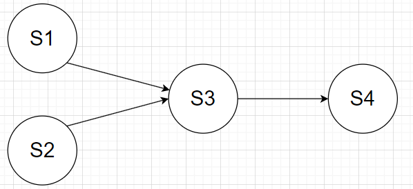

# 第二章-进程的描述与控制

## 1.什么是前趋图?为什么要引入前趋图?
所谓前趋图(Precedence Graph)，是指一个有向无环图，可记为DAG(Directed Acyclic Graph)，它用于描述进程之间执行的先后顺序。前趋图的存在可以更好地帮助我们描述程序的顺序和并发执行情况。

2.试画出下面四条语句的前趋图:

S1: a = x+y;

S2: b = z+1;

S3: c = a-b;

S4: w = c+1;

## 3.为什么程序并发执行会产生间断性特征?
程序在并发执行时，由于它们共享系统资源，以及为完成同一项任务面相互合作，致使在这些并发执行的程序之间形成了相互制约的关系。

## 4.程序并发执行时为什么会失去封闭性和可再现性?
**失去封闭性**：当系统中存在着多个可以并发执行的程序时，系统中的各种资源将为它们所共享，而这些资源的状态也由这些程序来改变，致使其中任一程序在运行时，其环境都必然会受到其它程序的影响。

**不可再现性**：程序在并发执行时，由于失去了封闭性，其计算结果必将与并发程序的执行速度有关，从而使程序的执行失去了可再现性。换而言之，程序经过多次执行后，虽然它们执行时的环境和初始条件相同，但得到的结果却各不相同。

## 5.在操作系统中为什么要引入进程的概念?它会产生什么样的影响?
在早期未配置OS的系统和单道批处理系统中，程序的执行方式是顺序执行，即在内存中仅装入一道用户程序，由它独占系统中的所有资源,只有在一个用户程序执行完成后才允许装入另一个程序并执行。可见，这种方式浪费资源、系统运行效率低等缺点。而在名道程序系统中，由于内存中可以同时装入多个程序，使它们共享系统资源，并发执行显然可以克服上述缺点。而为了实现对并发执行的程序加以描述和控制，人们引入了“进程”的概念。

## 6.试从动态性、并发性和独立性上比较进程和程序。

## 7.试说明 PCB 的作用具体表现在哪几个方面,为什么说 PCB 是进程存在的唯一标志

## 8.PCB 提供了进程管理和进程调度所需要的哪些信息?

## 9.进程控制块的组织方式有哪几种?

## 10.何谓操作系统内核?内核的主要功能是什么?

## 11.试说明进程在三个基本状态之间转换的典型原因:

## 12.为什么要引入挂起状态?该状态有哪些性质?

## 13.在进行进程切换时，所要保存的处理机状态信息有哪些?

## 14.试说明引起进程创建的主要事件。

## 15.试说明引起进程被撤消的主要事件

## 16.在创建一个进程时所要完成的主要工作是什么?

## 17.在撤消一个进程时所要完成的主要工作是什么?

## 18.试说明引起进程阻塞或被唤醒的主要事件是什么?

## 19.为什么要在OS中引入线程?

## 20.试说明线程具有哪些属性?

## 21.试从调度性、并发性、拥有资源及系统开销方面对进程和线程进行比较

## 22.线程控制块 TCB 中包含了哪些内容?

## 23.何谓用户级线程和内核支持线程?

## 24.试说明用户级线程的实现方法

## 25.试说明内核支持线程的实现方法

## 26.多线程模型有哪几种类型?多对一模型有何优缺点?