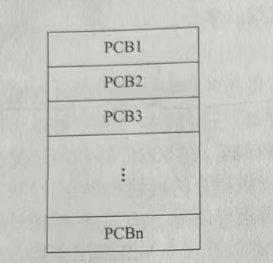
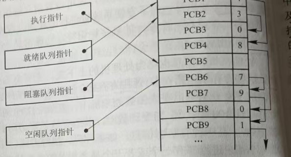
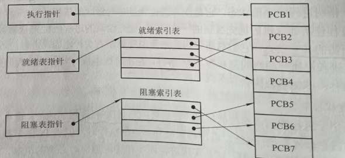
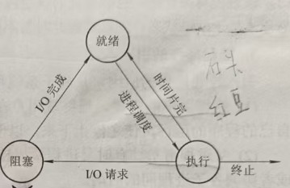

# 第二章-进程的描述与控制

## 1.什么是前趋图?为什么要引入前趋图?
所谓前趋图(Precedence Graph)，是指一个有向无环图，可记为DAG(Directed Acyclic Graph)，它用于描述进程之间执行的先后顺序。前趋图的存在可以更好地帮助我们描述程序的顺序和并发执行情况。

2.试画出下面四条语句的前趋图:

S1: a = x+y;

S2: b = z+1;

S3: c = a-b;

S4: w = c+1;

## 3.为什么程序并发执行会产生间断性特征?
程序在并发执行时，由于它们共享系统资源，以及为完成同一项任务面相互合作，致使在这些并发执行的程序之间形成了相互制约的关系。

## 4.程序并发执行时为什么会失去封闭性和可再现性?
**失去封闭性**：当系统中存在着多个可以并发执行的程序时，系统中的各种资源将为它们所共享，而这些资源的状态也由这些程序来改变，致使其中任一程序在运行时，其环境都必然会受到其它程序的影响。

**不可再现性**：程序在并发执行时，由于失去了封闭性，其计算结果必将与并发程序的执行速度有关，从而使程序的执行失去了可再现性。换而言之，程序经过多次执行后，虽然它们执行时的环境和初始条件相同，但得到的结果却各不相同。

## 5.在操作系统中为什么要引入进程的概念?它会产生什么样的影响?
在早期未配置OS的系统和单道批处理系统中，程序的执行方式是顺序执行，即在内存中仅装入一道用户程序，由它独占系统中的所有资源,只有在一个用户程序执行完成后才允许装入另一个程序并执行。可见，这种方式浪费资源、系统运行效率低等缺点。而在名道程序系统中，由于内存中可以同时装入多个程序，使它们共享系统资源，并发执行显然可以克服上述缺点。而为了实现对并发执行的程序加以描述和控制，人们引入了“进程”的概念。

## 6.试从动态性、并发性和独立性上比较进程和程序。
进程和程序是两个截然不同的概念，除了进程具有程序所没有的PCB结构外，还具有下面一些特征:
(1)动态性。进程的实质是进程实体的执行过程，因此，动态性就是进程的最基本的特征。动态性还表现在:“它由创建而产生，由调度而执行，由消而消亡。”可见，程实体有一定的生命期，而程序则只是一组有序指令的集合，并存放于某种介质上，其本身并不具有活动的含义，因而是静态的。

(2)并发性。是指多个进程实体同存于内存中，且能在一段时间内同时运行。引入进程的目的也正是为了使其进程实体能和其它进程实体并发执行。因此，并发性是进程的一重要特征，同时也成为OS的重要特征。而程序(没有建立PCB)是不能参与并发执行的。

(3)独立性，在传统的OS中，独立性是指进程实体是一个能独立运行、独立获得资和独立接受调度的基本单位。凡未建立PCB的程序都不能作为一个独立的单位参与运行。

## 7.试说明 PCB 的作用具体表现在哪几个方面,为什么说 PCB 是进程存在的唯一标志

PCB 的作用是使一个在多道程序环境下不能独立运行的程序(含数据)成为一个能独立运行的基本单位,一个能与其他进程并发执行的进程。

(1)作为独立运行基本单位的标志。当一个程序(含数据)配置了PCB后，就表示它是一个能在多道程序环境下独立运行的、合法的基本单位，也就具有取得OS服务的权利如打开文件系统中的文件，请求获得系统中的IO设备，以及与其它相关进程进行通信因此，当系统创建一个新进程时，就为它建立了一个PCB。进程结束时又回收其PCB，程于是也随之消亡。**系统是通过PCB感知进程的存在的。事实上，PCB已成为进程存在的唯一标志。**

> 外部标识符:方便用户（进程）对进程的访问。
> 
> 内部标识符:方便系统对进程的使用。

(2)能实现间断性运行方式。

(3)提供进程管理所需要的信息。

(4)提供进程调度所需要的信息。

(5)实现与其它进程的同步与通信。

## 8.PCB 提供了进程管理和进程调度所需要的哪些信息?

1. 只能根据该进程PCB 中记录的程序和数据在内存或外存中的始址指针-L>找到相应的程序和数据

2. PCB中的信息->访问文件系统中的文件或I/O设备;

3. PCB中的资源清单->了解到该进程所需的全部资源等。

## 9.进程控制块的组织方式有哪几种?

在一个系统中，通常可拥有数十个、数百个乃至数千个PCB。为了能对它们加以有效的管理，应该用适当的方式将这些PCB 组织起来。目前常用的组织方式有以下三种。

(1)**线性方式**，即将系统中所有的PCB都组织在一张线性表中，将该表的首址存放在内存的一个专用区域中。该方式实现简单、开销小，但每次查找时都需要扫描整张表，因此适合进程数目不多的系统。

(2)**链接方式**，即把具有相同状态进程的PCB 分别通过PCB中的链接字链接成一个队列。这样，可以形成就绪队列，若干个阻塞队列和空白队列。对就绪队列而言，往往按进程的优先级将PCB从高到低进行排列，将优先级高的进程PCB排在队列的前面。同样，也可把处于阻状态进程的 PCB 根据其阻塞原因的不同，排成多个阻塞队列，如等待 I/O操作完成的队列和等待内存分配的队列。

(3)**索引方式**，即系统根据所有进程状态的不同，建立几张索引表，例如，就绪索引表、阻塞索引表等，并把各索引表在内存的首地址记录在内存的一些专用单元中。在每个索引表的表目中，记录具有相应状态的某个PCB在PCB表中的地址。

## 10.何谓操作系统内核?内核的主要功能是什么?

通常将一些**与硬件紧密相关的模块(如中断处理程序等)**、**各种常用设备的驱动程序**以及**运行频率较高的模块(如时钟管理、进程调度和许多模块所公用的一些基本操作)**，都安排在紧靠硬件的软件层次中，将它们常驻内存，即通常被称为的S内核这

## 11.试说明进程在三个基本状态之间转换的典型原因:

进程在运行过程中会经常发生状态的转换。例如，处于就绪状态的进程，在调度程序为之分配了处理机之后便可执行，相应地，其状态就由就绪态转变为执行态;正在执行的进程就绪(当前进程)如果因分配给它的时间片已完而被剥夺处理机暂停执行时,其状态便由执行转为就绪;如果因发生某事件，致使当前进程的执行受阻(例如进程访问某临界资源，而该资源正被其它进程访时)，使之无法继续执行，则该进程状态将由执行转变为阻塞。

## 12.为什么要引入挂起状态?该状态有哪些性质?

**挂起**意味着此时该进程处于静止状态。如果进程正在执行，它将暂停执行若原本处于就绪状态，则该进程此时暂不接受调度。与挂起操作对应的操作是激活操作。

引入挂起操作的原因，是基于系统和用户的如下需要:

(1)终端用户的需要。当终端用户在自己的程序运行期间发现有可疑问题，希望暂自己的程序的运行，使之停止下来，以便用户研究其执行情况或对程序进行修改。

(2)父进程请求。有时父进程希望挂起自己的某个子进程，以便考查和修改该子进程或者协调各子进程间的活动。

(3)负荷调节的需要。当实时系统中的工作负荷较重，已可能影响到对实时任务的控制时，可由系统把一些不重要的进程挂起，以保证系统能正常运行。

(4)操作系统的需要。操作系统有时希望挂起某些进程，以便检查运行中的资源使用情况或进行记账。

## 13.在进行进程切换时，所要保存的处理机状态信息有哪些?

它必须保留自己运行时的CPU现场信息，再被调度运行时，还需要恢复其CPU现场信息。在有了PCB后，系统就可将CPU现场信保存在被中断进程的PCB中，供该进程再次被调度执行时恢复CPU现场时使用。

## 14.试说明引起进程创建的主要事件。

首先由进程申请一个空白PCB，并向PCB中填写用于控制和管理进程的信息，系统有能为该进程分配运行时所必须的足够的资源。

## 15.试说明引起进程被撤消的主要事件

当一个进程到达了自然结束点，或是出现了无法克服的错误，或是被操作系统所终结，或是被其他有终止权的进程所终结，它将进入终止状态。

## 16.在创建一个进程时所要完成的主要工作是什么?

首先由进程申请一个空白PCB，并向PCB 中填写用于控制和管理进程的信息:然后为该进程分配运行时所必须的资源;最后，把该进程转入就绪状态并插入就绪队列之中但如果进程所需的资源尚不能得到满足，比如系统尚无足够的内存使进程无法装入其中，此时创建工作尚未完成，进程不能被调度运行。

## 17.在撤消一个进程时所要完成的主要工作是什么?

进入终止态的进程以后不能再执行，但在操作系统中依然就绪保留一个记录，其中保存状态码和一些计时统计数据，供其他进程收集。一旦其他进程完成了对其信息的提取之后，操作系统就删除该进程，即将PCB清零。

## 18.试说明引起进程阻塞或被唤醒的主要事件是什么?

## 19.为什么要在OS中引入线程?

## 20.试说明线程具有哪些属性?

## 21.试从调度性、并发性、拥有资源及系统开销方面对进程和线程进行比较

## 22.线程控制块 TCB 中包含了哪些内容?

## 23.何谓用户级线程和内核支持线程?

## 24.试说明用户级线程的实现方法

## 25.试说明内核支持线程的实现方法

## 26.多线程模型有哪几种类型?多对一模型有何优缺点?